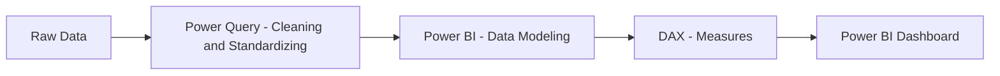
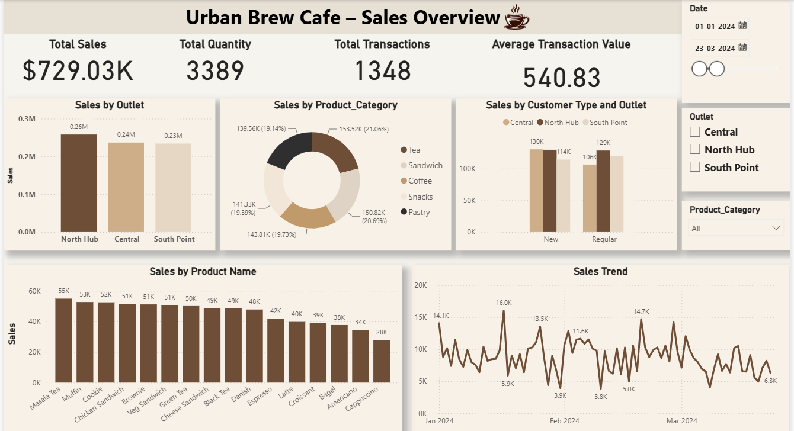

<div align="center">

# Urban Brew Cafe – Sales Analytics Dashboard

### End-to-End Sales Analytics Project using Power BI, Power Query and DAX

Analyzing café transactions across outlets, products, and customer types to surface insights that support better retail decision-making.


</div>

---

## Table of Contents

- [Project Overview](#project-overview)
- [Objectives](#objectives)
- [Tech Stack](#tech-stack)
- [Folder Structure](#folder-structure)
- [Data Pipeline](#data-pipeline)
- [Dataset](#dataset)
- [Data Preparation](#data-preparation)
- [Data Model](#data-model)
- [Key Insights](#key-insights)
- [Dashboard Features](#dashboard-features)
- [DAX Highlights](#dax-highlights)
- [Business Questions Answered](#business-questions-answered)
- [Skills Demonstrated](#skills-demonstrated)
- [Project Screenshots](#project-screenshots)
- [Future Improvements](#future-improvements)
- [Author](#author)

---

## Project Overview

This project walks through a complete sales analytics workflow for **Urban Brew Café**, a coffeehouse brand operating three outlets, starting from raw transaction data and ending with an interactive Power BI dashboard. Along the way, the data was cleaned and standardized in Power Query, modeled with a dedicated measures table, and turned into a set of KPIs and visuals that management can use to track performance without touching a spreadsheet.

The idea was to build something close to what a small retail analytics function would actually use — a clean pipeline from raw transactions to a dashboard stakeholders can filter and explore on their own.

---

## Objectives

- Clean and standardize raw transaction data
- Build a structured Power BI data model with a dedicated date table and measures table
- Create DAX measures for core KPIs (sales, quantity, transactions, average transaction value)
- Compare performance across outlets, product categories, and individual products
- Analyze day-wise sales trends and customer behavior (New vs. Regular)
- Present findings through an interactive, filterable dashboard

---

## Tech Stack

| Layer | Tools Used |
|---|---|
| Data Storage & Staging | CSV |
| Data Cleaning & Transformation | Power Query |
| Data Modeling & Measures | Power BI, DAX |
| Visualization | Power BI |

---

## Folder Structure

```
Urban-Brew-Cafe-PowerBI/
│
├── Data/
│   └── coffee_cafe_sales.csv        Raw transaction-level dataset
│
├── PowerBI/
│   └── Urban_Brew_Cafe_-_Prajwal.pbix   Power BI dashboard file
│
├── Screenshots/
│   └── sales_overview_dashboard.png
│
└── README.md
```

---

## Data Pipeline



---

## Dataset

The dataset (`coffee_cafe_sales.csv`) contains **2,010 transaction records** spanning **January to March 2024**, across three outlets, five product categories, and 16 individual products.

| Column | Description |
|---|---|
| Transaction_ID | Unique identifier for each sales transaction |
| Date | Date on which the transaction occurred |
| Outlet | The café outlet where the transaction took place (Central, North Hub, South Point) |
| Product_Category | The category the product belongs to (Coffee, Tea, Sandwich, Pastry, Snacks) |
| Product_Name | The specific product sold |
| Quantity | Number of units sold in the transaction |
| Unit_Price | Price per unit of the product |
| Total_Amount | Total value of the transaction |
| Customer_Type | Indicates whether the customer was Regular or New |

---

## Data Preparation

The raw file needed cleanup before it could be reliably used for analysis. Preparation was carried out in Power Query and included:

- **Standardizing the Outlet column** — the raw data contained inconsistent casing (`central`, `Central`, `CENTRAL`, `South Point`, `SOUTH POINT`, etc.), which was normalized to a consistent set of outlet names
- **Date transformation** — converting the raw `Date` column into a proper date type to support the date slicer and trend visuals
- **Data type correction** for numeric fields (Quantity, Unit_Price, Total_Amount) to ensure accurate aggregation
- **Column validation** — confirming each row correctly maps to its category, product, and customer type
- General cleaning to prepare the dataset for modeling

---

## Data Model

The Power BI file uses a structured model made up of three tables:

- **Sales** — the primary fact table holding transaction-level data
- **Date_Table** — a dedicated date dimension table driving the date slicer and trend analysis
- **Measures_Sales** — a dedicated table used to organize the DAX measures, kept separate from the raw data tables

This keeps the report's measures organized independently of the underlying data and supports filtering across date, outlet, and product category.

---

## Key Insights

<details>
<summary>Click to expand</summary>

<br>

- Total revenue across all transactions is approximately **$1.08M**, from **2,010** transaction records and **16** distinct products.
- Revenue is fairly evenly split across outlets: **North Hub** (~$366.7K), **Central** (~$360.9K), and **South Point** (~$356.0K) each contribute roughly a third of total sales.
- Product category revenue is also closely balanced, with **Tea** (~$228.6K) and **Sandwich** (~$225.2K) generating slightly more revenue than **Snacks**, **Coffee**, and **Pastry**.
- **Green Tea** and **Masala Tea** are the top-selling individual products by revenue, followed closely by **Brownie** and **Cookie**.
- New customers account for a marginally larger share of total revenue (~$559.5K) than Regular customers (~$524.2K), with a similar average spend per transaction between the two groups.
- The date slicer lets the KPIs and visuals be recalculated for any sub-period, making it possible to drill into shorter windows for peak-period analysis.

</details>

---

## Dashboard Features

**KPI Cards**

| KPI | Description |
|---|---|
| Total Sales | Sum of all transaction revenue |
| Total Quantity | Sum of all units sold |
| Total Transactions | Count of distinct transactions |
| Average Transaction Value | Total Sales divided by Total Transactions |

**Visualizations**

- Sales by Outlet
- Sales by Product Category
- Sales by Customer Type and Outlet
- Sales by Product Name
- Sales Trend (day-wise)

**Interactive Features**

- Slicers for Date (range selector), Outlet, and Product Category
- Cross-filtering across all visuals on the page
- DAX measures that update dynamically based on slicer selection

---

## DAX Highlights

The dashboard's KPI cards are powered by four measures defined in the **Measures_Sales** table:

| Measure | What it Represents |
|---|---|
| Total Sales | Sum of Total_Amount across all transactions |
| Total Quantity | Sum of Quantity across all transactions |
| Total Transactions | Distinct count of Transaction_ID |
| Average Transaction Value | Total Sales divided by Total Transactions |

These measures respond dynamically to the Date, Outlet, and Product Category filters and drive every KPI card on the report.

---

## Business Questions Answered

- Which outlets perform better in terms of sales and quantity sold?
- Which product categories contribute the most revenue?
- Which individual products are top performers?
- What is the day-wise sales trend?
- How do Regular and New customers behave?
- What is the average transaction value?
- What are the peak sales periods?
- Are there noticeable patterns across outlets and product categories?

---

## Skills Demonstrated

- Data cleaning and standardization with Power Query
- Structured Power BI data modeling (fact table, date table, measures table)
- DAX measure design for core KPIs
- Dashboard design for non-technical stakeholders
- Sales, product, and customer behavior analysis
- Structuring an end-to-end BI project

---

## Project Screenshots

**Power BI Dashboard**



---

## Future Improvements

- Automated data refresh from a live data source
- Sales forecasting using time intelligence
- Customer segmentation analysis
- Advanced time intelligence DAX measures (MoM, YoY comparisons)
- Profitability analysis (if cost data becomes available)
- Drill-through pages for outlet- and product-level detail

---

## Author

**Prajwal Naik**
